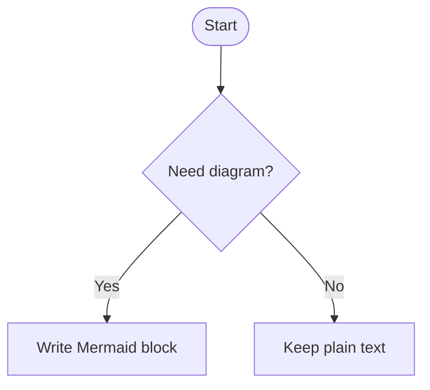

# Mermaid

Use this skill when documentation or planning would benefit from Mermaid diagrams.

This skill complements `writing` and `planning`; it does not replace them.

- use `writing` for the overall document or explanation
- use `planning` when the diagram belongs in a plan or architecture outline
- use `mermaid` to choose diagram types and write clear, maintainable Mermaid syntax inside Markdown

This skill is intentionally opinionated, but it should still respect the repository it is working in.

## Core Defaults

Prefer these defaults unless the project already uses something else consistently:

- Mermaid diagrams embedded directly in Markdown
- one diagram per concept
- small focused diagrams over one huge diagram
- simple syntax before advanced styling
- diagrams that stay readable in raw text, not only when rendered

If a repository already has a clear different documentation workflow, follow that workflow rather than forcing Mermaid into it.

## When to Use Mermaid

Mermaid is a strong fit when text alone becomes harder to follow.

Good examples:

- architecture overviews
- request or event flows
- user journeys and workflows
- state transitions
- domain relationships
- database schemas
- refactoring plans that benefit from before/after structure

Do not add a diagram just because a Markdown file feels plain.

If the same idea is already clearer as a short list, table, or paragraph, keep it textual.

## Diagram Type Selection

Choose the simplest fitting diagram type:

- `flowchart` for workflows, user journeys, and decision trees
- `sequenceDiagram` for interactions over time, requests, and message flows
- `classDiagram` for domain or object relationships
- `erDiagram` for database schemas and table relationships
- `stateDiagram-v2` for lifecycle and state transitions
- C4-style Mermaid diagrams when architecture levels really need it

Do not reach for class diagrams when a flowchart would explain the behavior better, and do not use sequence diagrams when there is no meaningful temporal interaction.

## Authoring Style

Prefer:

- meaningful labels
- stable node names
- straightforward arrows and relationships
- readable indentation
- comments with `%%` only when they add real maintenance value

Keep diagrams focused.

If a diagram is getting crowded:

- split it into multiple diagrams
- separate overview from detail
- move one branch of complexity into its own diagram

## Markdown Integration

Prefer fenced Mermaid blocks directly in the document:

````markdown

````

When the hosting platform already renders Mermaid in Markdown, prefer that first.

Keep the source close to the explanation it supports instead of hiding diagrams in a separate rendering pipeline by default.

## Keep It Maintainable

Treat Mermaid like source code.

Prefer:

- diagrams that evolve with the surrounding document
- labels that match repository terminology
- edits that are easy to review in diffs
- one clear purpose per diagram

Do not optimize first for decorative styling or presentation polish.

If the need is “make this visually polished for slides or exports,” that is a separate concern from the default Markdown diagram workflow.

## Validation

Mermaid syntax is easy to break with small mistakes.

Before finalizing:

- check that the diagram type is correct
- scan for invalid or misspelled keywords
- keep special characters conservative when possible
- preview the rendered result when the environment supports it
- simplify rather than debug an overcomplicated diagram

If the repository or target platform has Mermaid rendering support, verify the diagram there when practical.

## Workflow

### 1. Clarify the purpose

Before writing a diagram, ask:

- what idea should become easier to understand?
- who is the audience?
- is this structure, flow, state, or data?
- would one diagram help, or should this be split?

### 2. Choose the simplest fitting diagram type

Pick the smallest diagram type that explains the idea well.

### 3. Draft the core structure first

Start with the essential nodes and relationships.

Only add detail once the top-level shape is clearly right.

### 4. Integrate with the surrounding text

The document should still make sense without forcing the reader to decode the diagram alone.

Add a short lead-in and, when useful, a brief explanation after the diagram.

### 5. Verify and trim

Preview when practical, remove visual clutter, and split overly dense diagrams.

## Relationship to Pretty Rendering

This skill is for creating good Mermaid diagrams in Markdown first.

Do not assume that every Mermaid diagram needs themed SVG rendering or a separate polishing pipeline.

If a future workflow genuinely needs polished presentation exports, treat that as a separate optional skill rather than the default documentation path.

## Red Flags

- adding diagrams where a short paragraph would be clearer
- one huge diagram trying to explain everything
- choosing a fashionable diagram type instead of the right one
- styling or theming before the structure is clear
- diagrams whose labels do not match the surrounding text
- Mermaid blocks that are never previewed when rendering support exists
